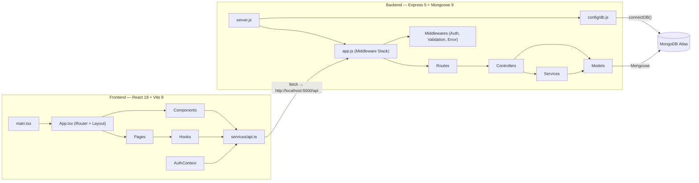

# ✂️ BarberShop — Project Plan & Development Guide

> **Last Updated:** August 12, 2026
> **Location:** `C:\Users\FAFEMO93\barber-app`

---

## 📐 1. Architecture Overview



| Layer      | Technology                              | Location                                                                |
| ---------- | --------------------------------------- | ----------------------------------------------------------------------- |
| Frontend   | React 19, TypeScript 6, CSS, Vite 8     | `client/` |
| Backend    | Node.js, Express 5, Joi, JWT, bcryptjs  | `server/` |
| Database   | MongoDB Atlas, Mongoose 9               | Connection in `server/src/config/db.js` |
| Security   | Helmet, CORS, Rate Limiting, HPP, Mongo Sanitize | `server/src/app.js` |

---

## ✅ 2. Current Feature Inventory

### Implemented

| Feature | Frontend | Backend | Notes |
|---|---|---|---|
| **Service Catalog** | `ServicesPage` + `ServiceCard` | Full CRUD `/api/services` | Public read, admin write |
| **Barber Team** | `BarbersPage` + `BarberCard` | Full CRUD `/api/barbers` | Public read, admin write |
| **Appointment Booking** | `BookingModal` | `POST /api/appointments` + conflict detection | Rate limited (5/15min) |
| **User Auth (Register/Login)** | `LoginPage`, `RegisterPage` | JWT auth + bcrypt | Token stored in `localStorage` |
| **User Profile** | `ProfilePage` | `GET /auth/me`, `PUT /auth/profile` | Name + phone editable |
| **Auth Context** | `AuthContext` | — | Auto-login via stored token |
| **Admin User Management** | — | Full CRUD `/api/users` | Admin-only endpoints |
| **Data Seeding** | — | `seed.js` | 4 services, 2 barbers, 1 admin |
| **DB Config Module** | — | `config/db.js` | ✅ Already extracted from server.js |
| **404 Page** | `NotFoundPage` | 404 handler middleware | Themed "Corte No Encontrado" |
| **Mock Data Fallback** | `api.ts` | — | Frontend works without backend |
| **Security Hardening** | — | Helmet, HPP, rate limiters, NoSQL sanitization, Content-Type enforcement | Production-grade |
| **Protected Routes** | `ProtectedRoute.tsx` | — | Auth guard + admin-only guard |
| **My Appointments** | `MyAppointmentsPage.tsx` | `GET /api/appointments/my`, `PUT /:id/cancel` | View, filter, cancel appointments |
| **Admin Dashboard (UI)** | `AdminDashboardPage.tsx` | — | Full CRUD for services, barbers, users + appointment status flow |
| **Appointment Status Flow** | Admin Dashboard | `PUT /api/appointments/:id` | `pending → confirmed → completed / cancelled` |
| **Search / Filter UI** | `ServicesPage.tsx`, `BarbersPage.tsx` | Client-side filtering | Search bar, price & duration chips, specialty filters |
| **Calendar & Slots UI** | `CalendarPicker.tsx`, `TimeSlotPicker.tsx` | — | Visual month calendar + morning/afternoon time chips |
| **Payment Checkout UI** | `BookingModal.tsx` | — | 3-step modal with order summary & card checkout step |
| **Reviews & Ratings UI** | `ReviewSection.tsx` | — | Star rating input, review cards, rating summary, form |
| **Password Reset UI Flow** | `ForgotPasswordPage`, `ResetPasswordPage` | — | Email recovery request & password strength meter flow |

### 🔲 Pending (Backend / External Microservices)

| Feature | Notes |
|---|---|
| **Image Storage Service** | Connect local upload endpoints / Cloudinary to Admin Dashboard |
| **Transactional Email Service** | Connect Nodemailer / SMTP to booking & status update triggers |
| **Stripe / PayPal Gateway** | Connect real payment gateway webhooks & charge processing |


---

## 🌐 3. API Endpoint Map

### Public Endpoints

| Method | Path | Description |
|---|---|---|
| `GET` | `/api/services` | List all services |
| `GET` | `/api/services/:id` | Get single service |
| `GET` | `/api/barbers` | List all barbers |
| `GET` | `/api/barbers/:id` | Get single barber |
| `POST` | `/api/appointments` | Book appointment (rate limited) |
| `POST` | `/api/auth/register` | Register new user |
| `POST` | `/api/auth/login` | Login |

### Authenticated Endpoints

| Method | Path | Access | Description |
|---|---|---|---|
| `GET` | `/api/auth/me` | Any user | Get current profile |
| `PUT` | `/api/auth/profile` | Any user | Update own profile |
| `GET` | `/api/appointments/:id` | Any user | Get single appointment ⚠️ *Missing ownership check* |

### Admin-Only Endpoints

| Method | Path | Description |
|---|---|---|
| `POST/PUT/DELETE` | `/api/services/:id` | Manage services |
| `POST/PUT/DELETE` | `/api/barbers/:id` | Manage barbers |
| `GET` | `/api/appointments` | List all appointments |
| `PUT/DELETE` | `/api/appointments/:id` | Manage appointments |
| `GET/POST/PUT/DELETE` | `/api/users[/:id]` | Manage users |

---

## 🗂️ 4. Frontend File Map

```
client/src/
├── main.tsx                    # App entry → StrictMode + BrowserRouter + AuthProvider
├── App.tsx                     # Layout: Navbar + Routes + Footer + BookingModal
├── App.css                     # Navbar, dropdown, skeleton animations
├── index.css                   # Design tokens, CSS reset, scrollbar
│
├── context/
│   └── AuthContext.tsx          # Auth state, login/register/logout/updateProfile
│
├── pages/
│   ├── ServicesPage.tsx/.css    # Service catalog grid (route: /)
│   ├── BarbersPage.tsx/.css     # Barber team grid (route: /barbers)
│   ├── LoginPage.tsx            # Login form (route: /login)
│   ├── RegisterPage.tsx         # Register form (route: /register)
│   ├── ProfilePage.tsx/.css     # User profile editor (route: /profile)
│   ├── NotFoundPage.tsx/.css    # 404 page (route: *)
│   └── AuthPages.css            # Shared glassmorphic auth styles
│
├── components/
│   ├── ServiceCard.tsx/.css     # Service display card
│   ├── BarberCard.tsx/.css      # Barber display card
│   ├── BookingModal.tsx/.css    # Multi-step booking form modal
│   └── Footer.tsx/.css          # Site footer
│
├── hooks/
│   ├── useServices.ts           # Fetch + cache services
│   └── useBarbers.ts            # Fetch + cache barbers
│
├── services/
│   └── api.ts                   # HTTP client, token injection, mock fallback
│
├── types/
│   └── index.ts                 # All TypeScript interfaces
│
├── utils/
│   └── formatters.ts            # formatPrice, formatDate, formatDuration, getTodayISO
│
├── styles/                      # Empty directory
└── assets/
    ├── hero.png
    ├── react.svg
    └── vite.svg
```

---

## 🗂️ 5. Backend File Map

```
server/src/
├── server.js                    # Entry point: loads dotenv, calls connectDB(), starts listener
├── app.js                       # Express config: middleware stack + route mounting
│
├── config/
│   └── db.js                    # MongoDB connection via Mongoose (connectDB function)
│
├── models/
│   ├── Appointment.js           # Schema: client info, barber ref, service ref, status, price
│   ├── Barber.js                # Schema: name, bio, image, specialties (Service refs)
│   ├── Service.js               # Schema: name, description, price, duration, image
│   └── User.js                  # Schema: publicId (UUID), name, email, password, role
│
├── controllers/
│   ├── authController.js        # register, login, getMe, updateProfile
│   ├── appointmentController.js # CRUD + delegates to AppointmentService
│   ├── barberController.js      # Full CRUD
│   ├── serviceController.js     # Full CRUD
│   └── userController.js        # Admin user CRUD
│
├── middlewares/
│   ├── auth.js                  # JWT protect + role authorize
│   ├── errorHandler.js          # 404 + global error handler
│   └── validators.js            # Joi schemas + validate() middleware factory
│
├── routes/
│   ├── authRoutes.js
│   ├── appointmentRoutes.js
│   ├── barberRoutes.js
│   ├── serviceRoutes.js
│   └── userRoutes.js
│
├── services/
│   └── appointmentService.js    # Business logic: date/time validation, conflict check
│
└── utils/
    ├── logger.js                # Security event logger (JSON in prod, formatted in dev)
    └── seed.js                  # DB seeder: services, barbers, admin user
```

---

## 🎨 6. Design System

| Token | Value | Usage |
|---|---|---|
| `--primary-color` | `#d4af37` (Gold) | Buttons, accents, highlights |
| `--secondary-color` | `#1a1a1a` | Cards, surfaces |
| `--bg-color` | `#0f0f0f` | Page background |
| `--card-bg` | `#1e1e1e` | Card backgrounds |
| `--text-color` | `#e0e0e0` | Body text |
| `--text-muted` | `#a0a0a0` | Secondary text |
| `--accent-color` | `#c5a028` | Hover states |
| `--error-color` | `#ff4d4d` | Error messages |
| `--success-color` | `#4caf50` | Success states |
| `--font-main` | Montserrat | Body copy |
| `--font-heading` | Google Sans | Headlines |

---

## 🐛 7. Bugs & Issues Found

### 🔴 Critical

| # | Location | Issue | Fix |
|---|---|---|---|
| 1 | `Appointment.js` | **Unique index blocks rebooking cancelled slots.** The compound index `{ barber, date, time }` is unique across ALL statuses. A cancelled appointment permanently blocks that time slot. | Use a partial filter index: `{ unique: true, partialFilterExpression: { status: { $in: ['pending', 'confirmed'] } } }` |
| 2 | `userController.js` | **`publicId` vs `_id` mismatch.** `User` model generates `publicId` (UUID) for external use, but controllers query with `User.findById()` expecting MongoDB `_id`. | Use `User.findOne({ publicId: req.params.id })` or accept both formats. |
| 3 | `appointmentService.js` | **`totalPrice` never populated.** The service creates appointments without looking up the service's price, leaving `totalPrice` as `undefined`. | Fetch the service document and set `totalPrice = service.price` before saving. |

### 🟡 Medium

| # | Location | Issue | Fix |
|---|---|---|---|
| 4 | `appointmentRoutes.js` | **No ownership check on `GET /api/appointments/:id`.** Any authenticated user can view any appointment by guessing the ID. | Add middleware to verify `req.user` owns the appointment or is admin. |
| 5 | `client/package.json` | **Backend packages in client dependencies.** `express-mongo-sanitize`, `express-rate-limit`, `helmet`, `jsonwebtoken`, `xss-clean` don't belong in the frontend bundle. | Remove these 5 packages from `client/package.json`. |
| 6 | `ServicesPage.tsx` | **Language inconsistency.** Page title is "Our Services" while rest of UI is Spanish. | Change to "Nuestros Servicios". |

---

## 🗺️ 8. Development Roadmap

### 🔥 Phase 1 — Fix & Stabilize
- [x] Fix critical bug #1: partial index on `Appointment` to allow slot reuse after cancellation
- [x] Fix critical bug #2: `publicId` routing in `userController.js`
- [x] Fix critical bug #3: populate `totalPrice` when creating appointments
- [x] Remove backend-only packages from `client/package.json`
- [x] Extract DB connection to `server/src/config/db.js`
- [x] Add ownership check on `GET /api/appointments/:id`
- [x] Fix language consistency (Spanish throughout)

### 🚀 Phase 2 — Core User Features
- [x] **My Appointments page** — Let authenticated users view, cancel, and track their bookings (`MyAppointmentsPage.tsx`)
- [x] **Admin Dashboard** — UI for managing services, barbers, appointments, and users (`AdminDashboardPage.tsx`)
- [x] **Appointment status flow** — UI to move appointments through `pending → confirmed → completed / cancelled`
- [x] **Protected routes** — Add `<ProtectedRoute>` wrapper component (`ProtectedRoute.tsx`)

### ✨ Phase 3 — Enhanced UX
- [ ] **Visual calendar** for time slot selection
- [ ] **Search & filter** on services and barbers pages
- [ ] **Image upload** for barber/service photos
- [ ] **Email notifications** — Booking confirmation, reminders, status changes
- [ ] **Toast notifications** — Replace `alert()` calls

### 💡 Phase 4 — Growth Features
- [ ] **Reviews & Ratings** — New `Review` model, star ratings on barbers/services
- [ ] **Password reset flow** — Forgot password email → reset token
- [ ] **Payment integration** — Connect Stripe/PayPal to `totalPrice`
